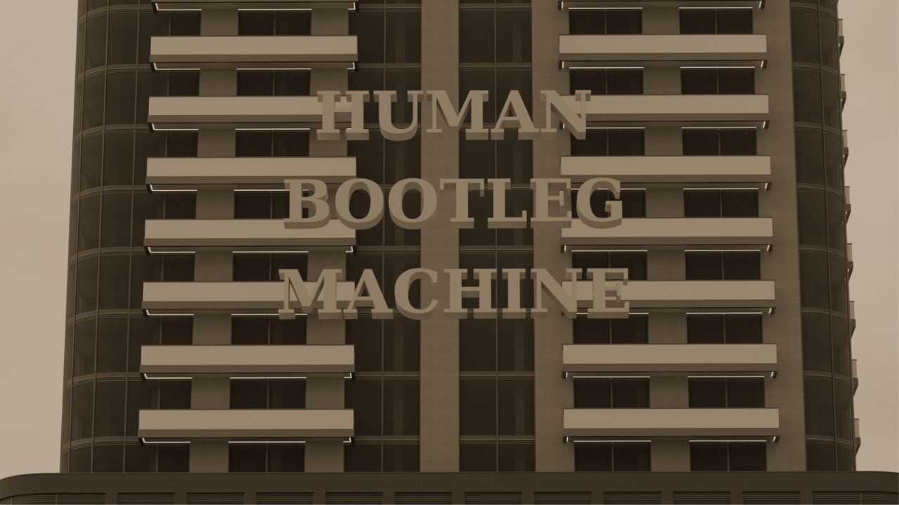

# Human Bootleg Machine
A demake of the Human Resource Machine for the NES made by Mars, Oumi & Kerem.
Featuring one demo level, a custom made OST and all the commands from the original Human Resource Machine*

*Negative numbers do not work, thus two commands wound up being useless.

This game fully works on actual hardware. Instructions on how to play can be found in the game itself.
Don't feel like downloading an emulator or playing on real hardware? Play it here! https://coockie1173.github.io/Human-Bootleg-Machine/
